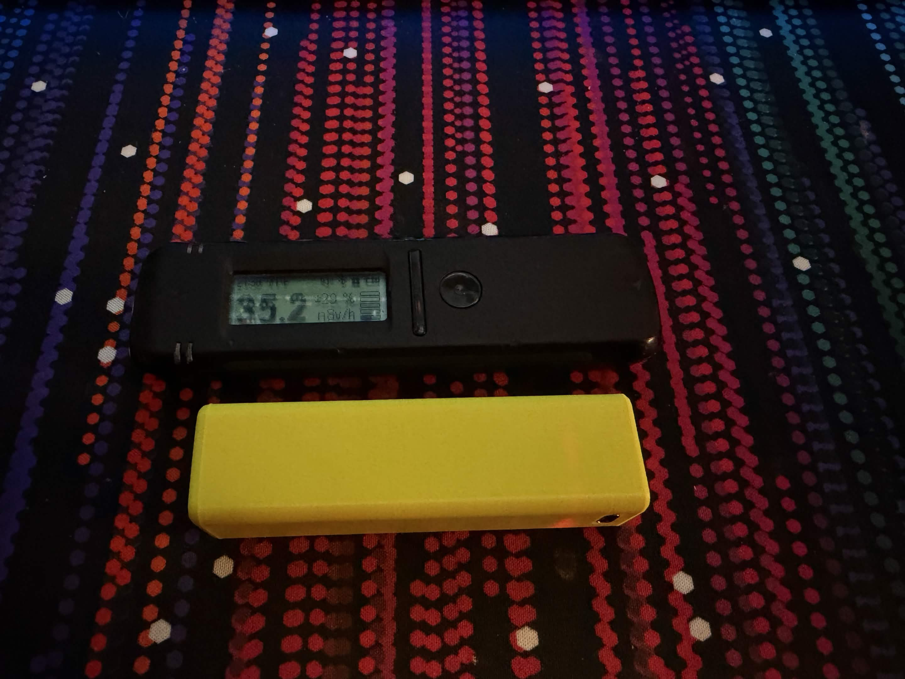
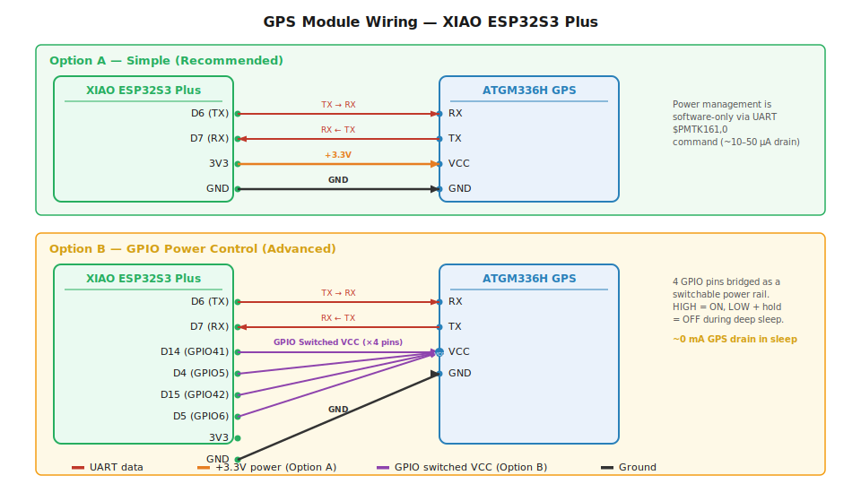
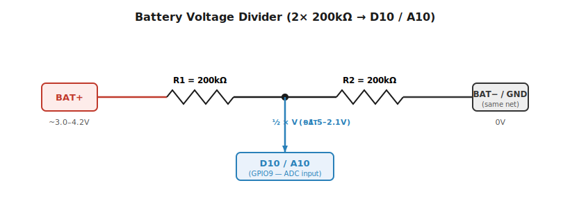

# RadiaLog

> **Don't want to build it yourself?** Pre-assembled RadiaLog devices are available at [RadiaMaps.com](https://radiamaps.com).

**Standalone ESP32-S3 datalogger for RadiaCode radiation detectors with GPS and WiFi.**

Connect to a RadiaCode via Bluetooth and RadiaLog automatically logs dose rate and count rate paired with GPS coordinates, then uploads everything to [RadiaMaps.com](https://radiamaps.com) over WiFi. No phone app required — configure everything through the built-in web portal.



[View the 3D printed case on MakerWorld](https://makerworld.com/en/models/2638033-radialog-radiacode-mapping-companion#profileId-2914169)

## What It Does

- Pairs with your RadiaCode-10x via Bluetooth (up to 4 simultaneously)
- Reads dose rate (uSv/h) and count rate (CPS) every 2 seconds
- Tags each reading with GPS coordinates, altitude, speed, and heading
- Stores readings in flash — survives power loss, never loses data
- Uploads batches to [RadiaMaps.com](https://radiamaps.com) when WiFi is available
- Hosts its own WiFi network with a web dashboard for live stats and configuration

---

## Hardware You Need

### Recommended Build

| Component | Purpose | Approx. Cost |
|-----------|---------|--------------|
| [Seeed XIAO ESP32S3 Plus](https://www.seeedstudio.com/Seeed-Studio-XIAO-ESP32S3-Plus-p-6361.html) | Brain of the device | ~$10 |
| [ATGM336H GPS Module](https://www.amazon.com/dp/B09LQDG1PQ) | GPS positioning | ~$8 |
| [RadiaCode-10x](https://radiacode.com) | Radiation detector | ~$300 |
| 18650 Li-ion Battery | Portable power | ~$5 |
| 2x 200k ohm Resistors | Battery voltage sensing | ~$0.10 |

**Total (excluding RadiaCode): ~$25**

### Wiring



| XIAO Pin (silkscreen) | GPIO | Direction | GPS Pin | Purpose |
|---|---|:---:|---|---|
| `D6` (TX) | GPIO43 | → | RX | UART data to GPS |
| `D7` (RX) | GPIO44 | ← | TX | UART data from GPS (NMEA) |
| `3V3` | — | → | VCC | Module power |
| `GND` | — | — | GND | Common ground |

> **Pin labels:** RadiaLog uses the Seeed XIAO's silkscreened `D##` labels as primary — those are what you'll see printed on the board when soldering. The GPIO column maps to the firmware's internal numbering for cross-referencing `firmware/src/config.h`.

> Prefer a printable version? Open [`docs/wiring_diagram.html`](docs/wiring_diagram.html) in your browser and use **Print → Save as PDF**.

### GPS Sleep Mode

The ATGM336H draws ~25 mA continuously while tracking, so RadiaLog powers
it down before entering shipping mode. Two strategies are used depending on
whether the board exposes the module's ON/OFF line:

- **Hardware cut (preferred)** — on boards where the GPS ON/OFF pin is
  broken out to an MCU GPIO (e.g. `BOARD_XIAO_ESP32S3` via `GPS_POWER_PIN`),
  the firmware drives the line LOW and latches the pad through deep sleep
  with `gpio_hold_en()`. VCC still reaches the module, but the ATGM336H
  enters full shutdown — essentially 0 mA draw. An external 10k pulldown
  to GND keeps the line LOW at boot so the GPS stays off until the firmware
  explicitly enables it.
- **Software backup mode (fallback)** — on boards where the ON/OFF pin
  isn't accessible (e.g. the stock ATGM336H breakout used with
  `BOARD_XIAO_ESP32S3_PLUS`, which only exposes VCC/GND/TX/RX/PPS), the
  firmware issues `$PMTK161,0` (and a couple of other AT6558 standby
  candidates) over UART before sleeping. The module powers down its
  receiver and RF front-end, dropping to roughly 10–50 µA while VCC stays
  applied — still low enough that a healthy cell sits for months.

On wake, `ATGM336H::begin()` releases the pad hold (if any), drives
`GPS_POWER_PIN` HIGH, and reopens UART — the module cold-starts and
reacquires a fix normally.

### Battery Voltage Divider

The XIAO ESP32S3 Plus doesn't have a built-in battery voltage sense circuit. Solder two 200k ohm resistors in series between BAT+ and BAT- (which is GND). Tap the midpoint to pin **D10 / A10** (GPIO9 in firmware).



This halves the battery voltage (4.2V becomes 2.1V) so it fits within the ESP32's ADC range. The high resistance keeps battery drain negligible (~10uA).

**Tip:** BAT- is the same as GND, so you can run the divider directly between the battery terminals. One wire from BAT+ through both resistors to BAT-, with the midpoint going to D10. This saves space in a tight enclosure.

### 3D Printable Case

[Download on MakerWorld](https://makerworld.com/en/models/2638033-radialog-radiacode-mapping-companion#profileId-2914169)

---

## Flashing the Firmware

### What You Need

- USB-C cable
- A computer with Chrome or Edge browser

### Step 1: Download the Firmware

Download the latest `.bin` file from the [Releases page](https://github.com/ryan-durbin/RadiaLog/releases/latest).

### Step 2: Flash It

1. Go to [ESP Web Tools](https://web.esphome.io/) in Chrome or Edge
2. Plug your XIAO ESP32S3 Plus into your computer via USB-C
3. Click **Connect**, select the serial port for your board
4. Click **Install** and choose the `.bin` file you downloaded
5. Wait for the flash to complete — that's it!

> **Note:** If your board doesn't show up, you may need to hold the **BOOT** button while plugging in the USB cable to enter bootloader mode.

### OTA Updates

After the first USB flash, you can update firmware over-the-air through the web portal. No need to plug in again.

### Building from Source (Advanced)

If you want to modify the firmware, you can build it yourself with [PlatformIO](https://platformio.org/install/cli):

```bash
cd firmware
pio run -e seeed_xiao_esp32s3_plus
pio run -e seeed_xiao_esp32s3_plus --target upload
```

---

## First-Time Setup

> Prefer a printable walkthrough with screenshots? Open
> [`docs/setup_guide_screenshots.html`](docs/setup_guide_screenshots.html)
> in your browser — it's a one-page illustrated quick-start (print to PDF
> or read on-screen) that covers the steps below with captured images of
> the portal and the RadiaMaps device-token flow.

1. **Power on** the RadiaLog — press the reset button on the lid to start the setup AP
2. **Connect** your phone or laptop to the `RadiaLog-XXXX` WiFi network (open network, no password)
3. **Open** `http://10.0.0.1` in a browser — the dashboard loads
4. **Go to Settings** and configure:
   - Your home/mobile WiFi network (up to 4 networks)
   - Your [RadiaMaps](https://radiamaps.com) device token (get one from your RadiaMaps account)
   - (Optional) Device name, reading interval, AP password
5. **Turn on** your RadiaCode — RadiaLog finds it via Bluetooth and starts logging automatically

That's it. Readings accumulate in the buffer and upload to RadiaMaps whenever WiFi is available.

> **Heads-up:** the setup AP stays up for 5 minutes after wake. If it times
> out before you finish, just tap the reset button again.

---

## Web Portal

The portal is accessible at `http://10.0.0.1` when connected to the RadiaLog's AP, or via mDNS at `http://radialog.local` when on the same WiFi network.

### Dashboard

Live overview of everything happening on the device:

- **Radiation** — dose rate (uSv/h) and count rate (CPS)
- **GPS** — fix status, satellite count, coordinates, mini map
- **WiFi** — connection status, signal strength, SSID
- **RadiaCode** — USB/BLE connection status
- **Buffer** — readings stored, pending upload, last/next upload time
- **Power** — battery voltage/percentage, uptime, time sync source
- **System** — CPU usage, loop time, free heap, disk space, GPS health
- **RadiaMaps Account** — username, subscription, lifetime readings

### Settings

- WiFi networks (up to 4, priority ordered)
- RadiaMaps device token
- Upload URL (defaults to radiamaps.com; override for self-hosted backends)
- Google Maps Geolocation API key (optional — enables WiFi-based fallback when GPS can't get a fix)
- Device name
- Reading interval (default: 2 seconds)
- AP password (default: open)
- BLE device MAC addresses (for connecting specific RadiaCodes)
- Display timeout and button wake (for boards with screens)

### Data

- Recent readings table (last 100)
- CSV export of entire buffer
- Mini dose rate chart

### Debug Console

- Live log streaming via WebSocket
- Filter by module: USB, GPS, WiFi, Upload, Buffer
- Filter by level: Error, Warn, Info, Debug

### Self-Test

Guided post-assembly QA page at `/self-test`. Walks through checks for the
status LED, boot button, battery ADC, GPS fix, WiFi STA, RadiaCode USB/BLE,
and display — handy after soldering or before packing a device for
shipment.

### Actions

- **Force Upload** — trigger immediate upload to RadiaMaps
- **Clear Buffer** — wipe all stored readings
- **Reboot** — restart the device
- **OTA Update** — upload new firmware (.bin file)
- **Shutdown** — enter deep sleep (shipping mode)
- **Factory Reset** — wipe all settings, WiFi credentials, paired devices, and buffered readings, then reboot

---

## How It Works

```
RadiaCode ──(BLE)──> ESP32-S3 ──> LittleFS Buffer ──(WiFi)──> RadiaMaps.com
                        |
GPS Module ─────────────┘
                        |
                Web Portal (AP)
```

### Reading Flow

1. RadiaLog polls the RadiaCode every 2 seconds via Bluetooth
2. GPS provides coordinates
3. Each reading (34 bytes: lat, lon, dose, count, timestamp, altitude, speed, heading, accuracy) is appended to flash
4. A background task checks once per minute if it's time to upload
5. Uploads happen daily (with random jitter) or immediately when WiFi connects after being offline for 24+ hours
6. Readings stay in the buffer until the server confirms receipt — nothing is deleted on faith

### Power Management

- **CPU runs at 80MHz** (down from 240MHz) — all peripherals use hardware clock dividers, unaffected
- **Light sleep** kicks in during idle periods between readings (ESP-IDF automatic frequency scaling)
- **WiFi AP auto-disables** after 5 minutes with no connected clients — saves 40-60mA. Hit the reset button to bring it back.
- **WIFI_PS_MIN_MODEM** enabled — radio sleeps between DTIM beacons in STA mode
- **Shipping mode** — hold the boot button for 5 seconds for deep sleep (negligible power draw)
- **GPS backup mode** — before entering deep sleep, the firmware sends the ATGM336H a `$PMTK161,0` command to drop it into backup mode (~10–50 µA, down from ~25 mA). See [GPS Sleep Mode](#gps-sleep-mode) for details.

### Buffer Resilience

Readings are stored in LittleFS flash across three files: binary reading data, per-reading upload status, and an index file. If power cuts mid-write, the device reconciles on boot by cross-checking actual file sizes against the index — you lose at most one reading.

---

## Status LED

| Pattern | Meaning |
|---------|---------|
| Solid | Everything connected and working |
| Slow blink (1s) | Waiting for GPS fix |
| Fast blink | Upload in progress |
| Double flash | No RadiaCode connected |
| Triple flash | Entering shipping mode (deep sleep) |

---

## Multiple RadiaCode Devices

RadiaLog supports up to 4 RadiaCode detectors via Bluetooth simultaneously. Add their MAC addresses in Settings. Each device's readings are logged independently with a device ID tag.

To find your RadiaCode's MAC address, use the BLE scan feature in the web portal's Settings page.

---

## RadiaMaps

[RadiaMaps.com](https://radiamaps.com) is the cloud platform that receives and visualizes your radiation mapping data. Create a free account, generate a device token, and paste it into the RadiaLog settings.

RadiaLog uploads readings in batches of up to 250 per request. Each reading includes GPS coordinates, dose rate, count rate, altitude, speed, and heading. Upload happens automatically — just keep your RadiaLog powered on near WiFi.

---

## Troubleshooting

### RadiaCode won't connect via Bluetooth
- Make sure your RadiaCode is powered on and not connected to the RadiaCode app on your phone (althorugh the RaidaCode should be able to broadcast to multiple devices)
- Press reset button on RadiaLog and log back into the webd dashboard
- If using specific MAC addresses in settings, verify they're correct via the BLE scan feature

### No GPS fix
- GPS needs a clear view of the sky — it won't work indoors
- First fix (cold start) can take 1-5 minutes. Subsequent fixes are faster thanks to A-GPS
- The LED blinks slowly while waiting for GPS fix

### Readings not uploading
- Check that your WiFi credentials are correct in Settings
- Verify your RadiaMaps device token is valid (dashboard shows account info when connected)
- The debug console shows upload attempts and any errors
- Uploads are scheduled once daily — use "Force Upload" in the portal for immediate upload

### Can't connect to RadiaLog WiFi
- The AP auto-disables after 5 minutes with no clients to save power
- Press the **reset button** on the board to restart and bring the AP back
- Default SSID is `RadiaLog-XXXX` (last 4 hex digits of the board's MAC address)

### Battery reading shows N/A
- The XIAO ESP32S3 Plus requires an external voltage divider (two 200k resistors) — see [wiring section](#battery-voltage-divider)
- Make sure the divider midpoint connects to pin **D10 / A10** (GPIO9), not D11 (GPIO10)

---

## Project Structure

```
firmware/
├── platformio.ini              # Build config (7 board targets)
├── sdkconfig.defaults          # ESP-IDF power management options
└── src/
    ├── main.cpp                # Setup + main loop
    ├── config.h                # Per-board pin definitions & constants
    ├── config_mgr.h/cpp        # Persistent JSON config (LittleFS + NVS)
    ├── buffer.h/cpp            # LittleFS-backed reading buffer (34 bytes/reading)
    ├── reading.h               # Reading struct definition
    ├── radiacode.h/cpp         # RadiaCode USB Host protocol
    ├── radiacode_ble.h/cpp     # RadiaCode BLE protocol
    ├── radiacode_mgr.h/cpp     # Multi-device manager (1 USB + 4 BLE)
    ├── gps/
    │   ├── gps.h               # Abstract GPS interface
    │   ├── atgm336h.h/cpp      # ATGM336H driver (UART, 9600 baud)
    │   └── lc76g_i2c.h/cpp     # LC76G driver (I2C, Waveshare board)
    ├── location_provider.h/cpp # GPS -> stored position -> WiFi geolocation fallback
    ├── uploader.h/cpp          # Background upload task (FreeRTOS, core 0)
    ├── wifi_mgr.h/cpp          # AP + STA dual mode, auto-reconnect, AP auto-off
    ├── battery.h/cpp           # ADC voltage monitor (16x oversampled)
    ├── battery_axp2101.h/cpp   # AXP2101 PMU driver (Waveshare AMOLED)
    ├── led.h/cpp               # Status LED patterns
    ├── display.h/cpp           # Display driver (TFT_eSPI / LovyanGFX)
    ├── shipping_mode.h/cpp     # Long-press deep sleep
    └── portal/
        ├── portal.h/cpp        # Async web server + API routes
        ├── debug_ws.h/cpp      # WebSocket debug console
        └── html/               # Dashboard, settings, data, debug pages
```

---

## Assembly

Don't have the tools or time to build one yourself? Pre-assembled RadiaLog devices are available for purchase at [RadiaMaps.com](https://radiamaps.com). Each unit is hand-assembled and tested in the USA.

**What you get:**
- Fully assembled RadiaLog (Seeed XIAO ESP32S3 Plus + ATGM336H GPS + battery)
- Firmware pre-flashed and ready to go
- 3D printed case included

---

## License

All rights reserved.
